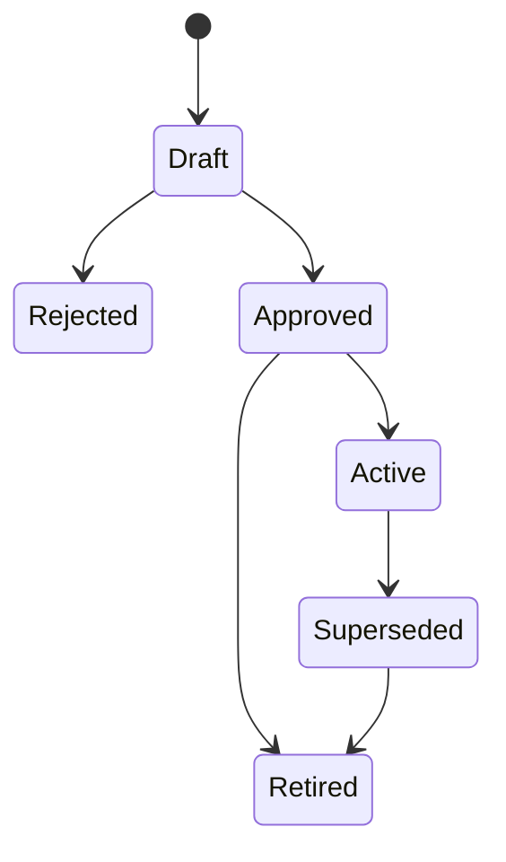
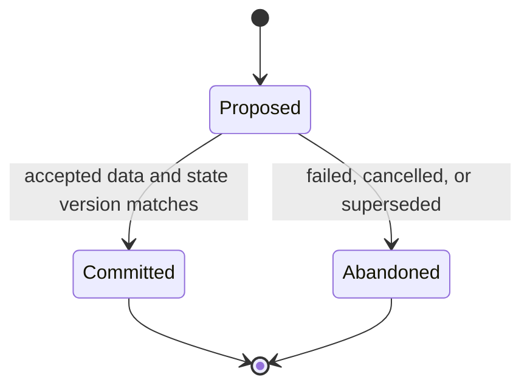

# FAB-001 — Logical metadata model

**Status:** Proposed design  
**Related issue:** [#5 — FAB-001](https://github.com/cetanibp/microsoft-data-ai-mastery/issues/5)  
**Requirements:** [Control-plane architecture requirements and principles](architecture.md)  
**Diagram source:** [metadata-model.mmd](metadata-model.mmd)

## Decision summary

Northstar will use an immutable, bundle-versioned definition model and a separate mutable runtime-state model.

- A **metadata release** is a complete, immutable snapshot of the approved control-plane definitions.
- Each environment activates one release through an audited **environment release** pointer.
- Every execution records the release it resolved and never changes releases mid-run.
- Environment configuration contains only safe logical references and enablement or routing choices.
- Physical connection identifiers and credentials remain in Fabric Variable Libraries, managed connections, or another approved secret boundary.
- Watermark progress is proposed for a run and committed only after the corresponding data is accepted.
- Definition rollback means activating an earlier compatible release. Runtime-state correction is a separately authorized operation and never occurs implicitly.

## Initial physical store

The initial implementation target is **SQL Database in Microsoft Fabric**, deployed as one control-plane database item per Development, Test, and Production workspace.

This is the best fit because the control plane is an operational transactional workload with small relational reads, concurrent state transitions, constraints, indexes, and atomic compare-and-commit behavior. SQL Database in Fabric uses the Azure SQL Database engine and supports Fabric source control and deployment pipelines.

A Fabric Warehouse remains appropriate for analytical history and operations reporting, but it is not the primary mutable control store. Frequent small inserts, updates, and deletes are a poor fit for Warehouse storage and can create fragmentation or write-conflict considerations.

The logical contract is intentionally product-neutral enough to move to Azure SQL Database or another transactional SQL engine if availability, recovery, security, or capacity evidence later requires it.

## Deployment topology

| Environment | Workspace | Control database | Definition source | Runtime state |
|---|---|---|---|---|
| Development | Northstar Data Platform - Dev | NorthstarControl | Approved SQL project and metadata release | Isolated Development state |
| Test | Northstar Data Platform - Test | NorthstarControl | Same promoted SQL project and release | Isolated Test state |
| Production | Northstar Data Platform - Prod | NorthstarControl | Same approved and promoted SQL project and release | Isolated Production state |

The same schema and release package move through every environment. The local environment identity and physical connection values are resolved at runtime through the OPS-001 configuration boundary.

## Model boundaries

### Immutable definition plane

Once a metadata release is approved, its definition rows are immutable. Changes create a new full release snapshot.

A full snapshot is preferred over row-level version chains because the Northstar scale of approximately 600 objects is small for metadata, while deterministic reconstruction, review, rollback, and testing are materially simpler.

### Mutable activation and runtime plane

Environment activation, execution attempts, watermark candidates, committed watermark state, and state events change operationally. These records use narrower write permissions than definition deployment.

### External configuration and secret plane

The database stores logical keys such as `clinical-ehr-reader` or `bronze-landing-zone`. Fabric Variable Libraries or managed connections resolve those keys to environment-specific item, workspace, connection, or storage values. Secret material is never returned through the metadata contract.

## Entity catalog

### Release and environment

| Entity | Stable identity | Purpose and important attributes |
|---|---|---|
| MetadataRelease | `release_id`, `release_version` | Complete immutable definition bundle; status, content hash, source commit, change reason, created and approved evidence |
| Environment | `environment_id`, `environment_code` | Safe environment identity such as development, test, or production |
| EnvironmentRelease | `environment_id` | Active release pointer; activated by, activated time, approval reference, prior release, and activation event |
| SourceEnvironmentConfig | release + environment + source | Safe logical connection key, landing-zone key, enabled state, and environment-specific extraction limits |
| ObjectEnvironmentConfig | release + environment + ingestion object | Object enablement, priority override, concurrency-policy reference, and safe routing aliases |

### Source, target, and ingestion definitions

| Entity | Stable identity | Purpose and important attributes |
|---|---|---|
| SourceSystem | release + `source_system_key` | Logical source, domain, source type, ownership reference, classification, and default connection key |
| SourceObject | release + `source_object_key` | Source system member; namespace, object name, object type, stable business identity, schema-drift policy, and source classification |
| TargetObject | release + `target_object_key` | Target layer, workspace or store alias, namespace, object name, write disposition, and publication boundary |
| IngestionObject | release + `ingestion_object_key` | Binds one source object to one target object and assigns load, execution, schedule, SLO, quality, and ownership contracts |
| ObjectDependency | release + predecessor + successor | Directed dependency; dependency condition, optionality, and activation rule |
| ExecutionPolicy | release + `execution_policy_key` | Timeout, retry count and delay, priority, concurrency group, maximum parallelism, and recovery mode |

### Load and watermark policy

| Entity | Stable identity | Purpose and important attributes |
|---|---|---|
| LoadPolicy | release + `load_policy_key` | Enumerated strategy: FULL, WATERMARK, APPEND, or SNAPSHOT; duplicate behavior, delete behavior, schema behavior, and idempotency contract |
| StrategyParameterDefinition | `strategy_type` + `parameter_key` | Allowlisted parameter name, type, requirement, bounds, and secret prohibition |
| LoadPolicyParameter | release + load policy + parameter | Validated typed policy value; arbitrary SQL and executable expressions are prohibited |
| WatermarkPolicy | release + `watermark_policy_key` | Column identity, logical data type, comparison operator, overlap amount, initial value policy, upper-bound mode, and late-arrival behavior |

Only WATERMARK load policies may reference a WatermarkPolicy. APPEND may use immutable input identity but does not advance a source-column watermark. SNAPSHOT identifies a complete effective-time boundary. FULL loads replace or reconcile the full selected scope.

### Schedule, quality, SLO, and ownership

| Entity | Stable identity | Purpose and important attributes |
|---|---|---|
| Schedule | release + `schedule_key` | DAILY, INTERVAL, EVENT, or MANUAL; IANA time zone, expected windows, trigger alias, and activation rules |
| ObjectSchedule | release + ingestion object + schedule | Associates an object with one or more schedules and optional deadline offsets |
| SloDefinition | release + `slo_key` | FRESHNESS, RELIABILITY, DURATION, or QUALITY metric; operator, target, evaluation window, severity, and breach policy |
| ObjectSlo | release + ingestion object + SLO | Applies an objective and indicates whether it is required for publication |
| QualityPolicy | release + `quality_policy_key` | Contract reference owned by issue #7; BLOCK or WARN enforcement, quarantine expectation, and policy version |
| ObjectQualityPolicy | release + ingestion object + quality policy | Applies an ordered quality policy to an object |
| OwnerGroup | release + `owner_group_key` | Named accountable group and non-secret routing alias |
| ObjectOwnership | release + ingestion object + owner group + role | ENGINEERING, SOURCE_STEWARD, DATA_PRODUCT, OPERATIONS, INCIDENT, or APPROVER responsibility |

### Runtime state and evidence

| Entity | Identity | Purpose and important attributes |
|---|---|---|
| ExecutionRun | `run_id` | Parent orchestration execution; environment, active release, trigger, correlation ID, requested scope, status, and timestamps |
| ObjectRun | `object_run_id` | Object attempt; run, ingestion object key, attempt number, resolved release, input boundary, status, counts, and error classification |
| WatermarkState | environment + ingestion object | Last committed value, value type, state version, committing object run, and commit time |
| WatermarkCandidate | `candidate_id` | Proposed from/to boundary for one object run; observed state version and PROPOSED, COMMITTED, or ABANDONED status |
| StateEvent | `state_event_id` | Append-only evidence for activation, claim, transition, commit, abandonment, correction, or recovery; actor, reason, correlation, before hash, and after hash |

ExecutionRun and ObjectRun define the correlation contract required by later implementation. Issue #6 may extend their operational columns without changing stable identifiers or release semantics. Issue #9 may project StateEvent and run history into an analytical operations store.

## Cardinality and relationship rules

1. A MetadataRelease contains complete definition rows and is immutable after approval.
2. An Environment has exactly one active EnvironmentRelease pointer at a time.
3. An EnvironmentRelease references only an approved MetadataRelease.
4. A SourceSystem contains zero or more SourceObjects.
5. An IngestionObject binds exactly one SourceObject to exactly one TargetObject.
6. An IngestionObject references exactly one LoadPolicy and one ExecutionPolicy.
7. A WATERMARK LoadPolicy references exactly one WatermarkPolicy; other strategies do not.
8. An IngestionObject has at least one ObjectSchedule unless it is explicitly MANUAL or EVENT driven.
9. A production-enabled IngestionObject has at least one freshness or deadline SLO and required ownership roles.
10. An ObjectDependency connects two distinct IngestionObjects in the same release.
11. The active dependency graph must be acyclic within an environment.
12. Environment configuration can disable an object but cannot redefine its source, target, or executable logic.
13. Every ExecutionRun references exactly one environment and one metadata release.
14. Every ObjectRun inherits the ExecutionRun environment and release.
15. An ObjectRun can have at most one active WatermarkCandidate.
16. A WatermarkState exists only for a WATERMARK ingestion object and environment.
17. StateEvent is append-only and cannot be used as the active state by itself.

## Version and activation lifecycle

### Metadata release states

- **Draft:** mutable only through the reviewed source workflow.
- **Rejected:** retained as evidence but cannot activate.
- **Approved:** immutable and eligible for environment activation.
- **Active:** selected by at least one environment.
- **Superseded:** no longer active but retained for replay and evidence.
- **Retired:** unavailable for new activations; historical runs still reference it.

Activation is an operational change with actor, approval reference, source commit, old release, new release, timestamp, and correlation ID. Activating an earlier release is allowed only when its schema and runtime-state contract are compatible. Otherwise the recovery plan must use a forward release.

## Watermark transition protocol

For a WATERMARK object:

1. Start a transaction in the local control database.
2. Read WatermarkState and its concurrency token.
3. Derive the next bounded range according to WatermarkPolicy.
4. Insert a PROPOSED WatermarkCandidate with the observed state version and object run identity.
5. Perform extraction and acceptance outside the state transaction.
6. After the target and required blocking checks succeed, start a commit transaction.
7. Verify the current state version still equals the candidate's observed version.
8. Update WatermarkState, mark the candidate COMMITTED, and append StateEvent atomically.
9. If the run fails, mark the candidate ABANDONED without changing WatermarkState.
10. A version mismatch prevents silent advancement and routes the run to recovery review.

This protocol prevents a started or failed run from advancing the committed boundary. The later ingestion implementation must also make target writes idempotent for the selected range.

## Dependency semantics

Dependencies are evaluated within the resolved metadata release and environment.

- `SUCCESS`: predecessor must succeed for the same scheduling window or correlation scope.
- `COMPLETION`: predecessor may succeed or complete with an allowed warning.
- `DATA_AVAILABLE`: predecessor must publish the expected accepted boundary.
- `OPTIONAL`: dependency contributes ordering but does not block when the predecessor is disabled.

Cross-release dependency resolution is prohibited. A disabled required predecessor makes the successor ineligible and produces a configuration error. Cycles are rejected before release approval.

## Schedule semantics

- IANA time-zone identifiers are required; fixed UTC offsets and platform-specific display names are not definition keys.
- A schedule describes expected eligibility and service timing. Fabric triggers may invoke the shared orchestrator, but the control plane determines which objects are runnable.
- DAILY schedules use local eligibility windows and handle daylight-saving transitions explicitly.
- INTERVAL schedules define a duration and anchor.
- EVENT schedules use an allowlisted trigger alias rather than an endpoint or credential.
- MANUAL schedules require a recorded actor, reason, and requested scope.
- Catch-up and overlapping-window behavior are declared by the execution and watermark policies.

## Environment resolution contract

The shared orchestrator receives or resolves only an `environment_code`. It then:

1. verifies the runtime environment against the active OPS-001 Variable Library value set;
2. loads the environment's active approved MetadataRelease;
3. joins SourceEnvironmentConfig and ObjectEnvironmentConfig;
4. resolves logical connection and routing keys through the approved Fabric configuration boundary;
5. rejects missing keys, secret-like literal values, environment mismatches, or disabled objects;
6. records the release and configuration hashes in ExecutionRun.

No pipeline or notebook branch is permitted for Development, Test, or Production behavior.

## Ownership minimums

Every production-enabled ingestion object requires:

- one ENGINEERING owner;
- one SOURCE_STEWARD owner;
- one OPERATIONS or INCIDENT owner;
- one DATA_PRODUCT owner when the target is published for consumption.

An owner record contains a group key and routing alias, not a personal email address or credential. Issue #9 will map the routing alias to the approved alerting destination.

## Validation invariants

A release cannot become Approved when any of the following is true:

- a referenced entity is absent from the same release;
- a stable key is duplicated within its scope;
- a production-enabled object lacks schedule, SLO, or required owner coverage;
- a WATERMARK strategy lacks a complete WatermarkPolicy;
- a non-WATERMARK strategy references a WatermarkPolicy;
- a parameter is unknown, incorrectly typed, out of range, or contains secret-like material;
- a source, target, or environment configuration contains a physical credential;
- a required environment configuration is missing;
- a dependency is self-referencing, cyclic, or points across releases;
- two active definitions claim the same environment and logical ingestion identity;
- a release content hash does not match the reviewed source package.

## Requirement coverage

| Requirement group | Primary entities or rules |
|---|---|
| FR-01–FR-02 | SourceSystem, SourceObject, TargetObject, stable release-scoped keys |
| FR-03–FR-04 | LoadPolicy, StrategyParameterDefinition, LoadPolicyParameter |
| FR-05 | ObjectDependency and DAG validation |
| FR-06 | Schedule, ObjectSchedule, ExecutionPolicy, ObjectEnvironmentConfig |
| FR-07 | SloDefinition and ObjectSlo |
| FR-08 | OwnerGroup and ObjectOwnership |
| FR-09–FR-10 | Environment, EnvironmentRelease, SourceEnvironmentConfig, ObjectEnvironmentConfig |
| FR-11 | WatermarkPolicy separated from WatermarkState |
| FR-12 | ExecutionRun and ObjectRun resolved release identity |
| FR-13–FR-14 | MetadataRelease lifecycle, EnvironmentRelease, StateEvent |
| FR-15 | Approval-time validation invariants |
| FR-16 | Stable selection keys and schedule, domain, environment, dependency, and recovery attributes |
| FR-17 | ExecutionRun, ObjectRun, StateEvent correlation identities |
| FR-18 | Synthetic Northstar seeds only |
| NFR-01 | External secret boundary and secret-like value validation |
| NFR-02–NFR-04 | WatermarkCandidate compare-and-commit protocol and idempotent run identity |
| NFR-05–NFR-06 | Normalized definitions, indexed selection contract, transactional operational store |
| NFR-07 | Immutable releases and append-only StateEvent |
| NFR-08–NFR-10 | Declarative policies, portable logical contract, synthetic automated tests |
| NFR-11 | Release activation rollback and separately governed state recovery |
| NFR-12 | Release, environment, run, object-run, and correlation keys |

## Alternatives and tradeoffs

### Row-level definition versioning

Rejected for the initial implementation. It avoids full-snapshot duplication but makes exact run reconstruction, joins, validation, rollback, and review more complex. Metadata volume is too small for that complexity to provide material value.

### Fabric Warehouse as the mutable control store

Rejected for the initial implementation. Warehouse is optimized for analytical workloads and larger set-based operations. The control plane needs frequent small state transitions, transactional constraints, and concurrency-safe watermark commits.

### Lakehouse Delta tables as the only control store

Rejected for the initial implementation. Delta can support metadata and state, but a SQL transactional control plane offers clearer constraints, relational validation, application-style DML, and concurrency semantics for this scenario. A Lakehouse remains suitable for scalable execution evidence or analytical projections.

### Arbitrary SQL expressions in metadata

Rejected. This would create injection, portability, review, and support risks. New behavior must be implemented through an allowlisted strategy or parameter contract.

## References

- [SQL database in Microsoft Fabric overview](https://learn.microsoft.com/en-us/fabric/database/sql/overview)
- [Fabric data-store decision guide](https://learn.microsoft.com/en-us/fabric/fundamentals/decision-guide-data-store)
- [SQL database source-control integration](https://learn.microsoft.com/en-us/fabric/database/sql/source-control)
- [SQL database deployment pipelines](https://learn.microsoft.com/en-us/fabric/database/sql/deployment-pipelines)
- [Fabric Warehouse performance guidance](https://learn.microsoft.com/en-us/fabric/data-warehouse/guidelines-warehouse-performance)
- [Fabric Warehouse transaction limitations](https://learn.microsoft.com/en-us/fabric/data-warehouse/transactions)
