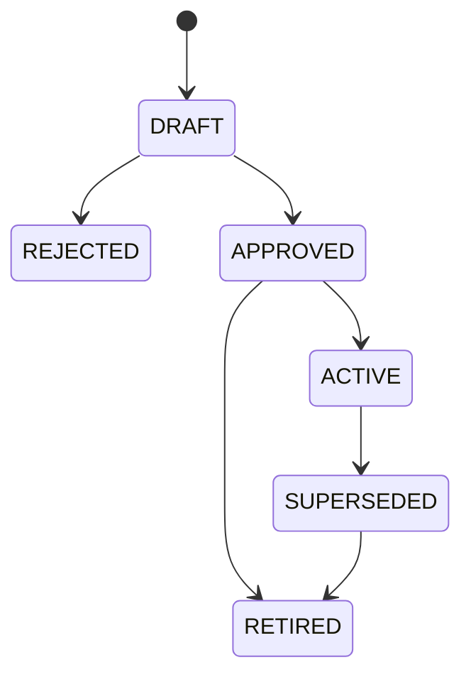

# FAB-001 — Ownership and metadata lifecycle

**Status:** Complete  
**Related issue:** [#5 — FAB-001](https://github.com/cetanibp/microsoft-data-ai-mastery/issues/5)  
**Inherited lifecycle:** [OPS-001 release process](../../02-dataops-devops/OPS-001/RELEASE-PROCESS.md) and [rollback guidance](../../02-dataops-devops/OPS-001/ROLLBACK.md)

## Purpose

This guide defines who may propose, approve, activate, operate, recover, and retire ingestion control-plane metadata. It separates three different activities that must not be treated as one change:

1. deploying schema and approved definitions;
2. activating a metadata release for an environment;
3. correcting mutable runtime state.

The control-plane database contains relational safeguards, but permissions, reviewed procedures, and retained evidence enforce the complete lifecycle.

## Core governance rules

- A metadata release is a complete definition snapshot.
- Approved child definitions are immutable; any material definition change creates a new release.
- Each environment resolves exactly one release through `ctrl.EnvironmentRelease`.
- Every run records its environment and release and never switches release mid-run.
- Activation is an audited operational decision, not an implicit side effect of schema deployment.
- Definition rollback and runtime-state recovery are separate decisions.
- Historical release, run, watermark, and audit records are retained while referenced.
- Production changes follow the accepted OPS-001 validation, Test, approval, and promotion path.
- Owner records use stable group keys and non-secret routing aliases, not individual email addresses.

## Ownership roles

### Platform-level responsibilities

| Responsibility | Accountable role | Supporting roles |
|---|---|---|
| Metadata schema and validation contract | Platform engineering | Security, operations, downstream framework owners |
| SQL Database deployment package | Platform engineering | Release owner |
| Metadata release content | Metadata definition owner | Source stewards, data-product owners |
| Release approval | Designated approver | Platform engineering, source stewards |
| Environment activation | Release owner | Environment operator |
| Managed connection and identity boundary | Security/platform administrator | Platform engineering |
| Runtime orchestration behavior | Ingestion engineering | Operations |
| Routine run recovery | Operations | Ingestion engineering |
| Watermark or state correction | Authorized recovery approver | Operations, source steward |
| Incident command and escalation | Incident owner | Operations, engineering, data-product owner |
| SLO and publication decision | Data-product owner | Operations, quality owner |
| Production promotion | Release owner and required reviewer | Platform engineering, operations |

One person may hold multiple roles in this single-maintainer reference implementation, but the evidence must still name which responsibility was exercised. A production organization should separate author, approver, and operator when staffing permits.

### Object ownership roles

The `ctrl.ObjectOwnership` contract supports these exact roles:

| Role | Accountability |
|---|---|
| `ENGINEERING` | Metadata definition, ingestion implementation, technical recovery, and defect correction |
| `SOURCE_STEWARD` | Source meaning, availability, schema change awareness, and acceptable extraction boundaries |
| `DATA_PRODUCT` | Consumer contract, publication decision, quality expectations, and business impact |
| `OPERATIONS` | Scheduling, monitoring, first response, rerun, and escalation |
| `INCIDENT` | Incident ownership, communications, severity, and coordinated recovery |
| `APPROVER` | Formal release or exceptional-state-change authorization |

Every Production-enabled ingestion object requires:

- at least one `ENGINEERING` owner;
- at least one `SOURCE_STEWARD` owner;
- at least one `OPERATIONS` or `INCIDENT` owner;
- at least one `DATA_PRODUCT` owner when the target crosses a governed publication boundary.

The routing alias is later resolved by the observability implementation in Issue #9. It must not contain an email address, webhook, endpoint, token, or credential.

## Release identity and versioning

Each `ctrl.MetadataRelease` has four independent traceability fields:

| Field | Meaning |
|---|---|
| `release_id` | Immutable machine identity used by relational and runtime records |
| `release_version` | Human-readable version, normally semantic `major.minor.patch` |
| `content_hash` | SHA-256 digest of the normalized release content |
| `source_commit_sha` | Exact reviewed Git commit that produced the release |

Version guidance:

- **Major:** incompatible metadata contract or schema behavior requiring coordinated consumer changes.
- **Minor:** backward-compatible additions such as new objects, policies, or optional attributes.
- **Patch:** backward-compatible correction that does not change the consumer contract.

A version is never reused for different content. If content changes after review, generate a new hash and version and repeat validation.

## Release states

The physical model supports these states:

| State | Meaning | Eligible for activation? | Mutable definitions? |
|---|---|---:|---:|
| `DRAFT` | Proposed snapshot under review | No | Only through reviewed source changes |
| `REJECTED` | Review failed or proposal withdrawn | No | No; preserve evidence |
| `APPROVED` | Validated, authorized, immutable snapshot | Yes | No |
| `ACTIVE` | Governance marker indicating current environment use | Yes | No |
| `SUPERSEDED` | Replaced by a newer release; retained for evidence or compatible replay | Existing historical use only | No |
| `RETIRED` | Not permitted for new activation | No | No |

The authoritative current selection is the environment pointer in `ctrl.EnvironmentRelease`. The release status is its governance classification. Runtime code must never infer the current release by sorting versions or timestamps.

Allowed lifecycle transitions:

A release may not return to Draft after approval. A correction creates a new release.

## Definition lifecycle

### 1. Propose

The author creates a complete release snapshot containing:

- source, target, and ingestion objects;
- environment configuration with logical references only;
- load, watermark, execution, schedule, quality, and SLO policies;
- dependency edges;
- ownership assignments;
- release version, content hash, source commit, and change reason.

### 2. Validate

Before approval:

- repository contract tests must pass;
- relational and semantic validation must pass;
- dependency-cycle validation must pass;
- no secret-like or protected values may be present;
- every enabled Production object must satisfy ownership, schedule, SLO, and policy requirements;
- downstream compatibility with Issues #6, #7, and #9 must be reviewed;
- the recovery plan must state whether definition rollback is safe.

### 3. Review and approve

The approver evaluates:

- scope and business reason;
- source and data-product owner acknowledgment where applicable;
- security and classification impact;
- environment-specific behavior;
- schema and consumer compatibility;
- validation evidence;
- activation, verification, and recovery plans.

Approval records `approved_by`, `approved_at_utc`, the reviewed commit, and an approval reference. Approval makes the release immutable.

### 4. Deploy

Definitions follow OPS-001:

1. merge the approved PR;
2. synchronize Development from Git;
3. validate Development;
4. promote the same definitions to Test;
5. validate Test;
6. obtain Production approval;
7. promote to Production;
8. perform post-deployment verification.

Deployment makes definitions available. It does not by itself authorize activation.

### 5. Activate

Activation for an environment must occur in one transaction:

1. lock or otherwise serialize the environment activation decision;
2. confirm the target release is `APPROVED` or `ACTIVE`;
3. confirm the release content hash and source commit match approved evidence;
4. run `ctrl.vw_MetadataValidationIssue` for the release and environment;
5. reject unresolved connections, invalid dependencies, or missing ownership;
6. capture the existing release as `prior_release_id`;
7. update `ctrl.EnvironmentRelease`;
8. append a `RELEASE_ACTIVATED` `audit.StateEvent` with actor, reason, approval reference, correlation ID, and before/after hashes;
9. commit atomically;
10. run the post-activation resolution and smoke checks.

A new `ops.ExecutionRun` may resolve the new release only after the activation transaction commits. Existing runs remain pinned to their original release.

### 6. Supersede or retire

A release becomes superseded after every intended environment has moved to a replacement and no new recovery run should select it by default. Retirement requires confirmation that:

- no environment points to it;
- no approved replay or recovery plan still requires new activation;
- referenced run, watermark, and audit history remains queryable;
- retention and audit requirements are met.

Retirement does not delete the release.

## Environment promotion and activation

| Stage | Minimum gate | Activation authority | Required evidence |
|---|---|---|---|
| Development | Contract tests and successful deployment | Platform engineering | commit, validation result, active-resolution query |
| Test | Development pass and controlled promotion | Release owner | deployment ID, Test validation, compatibility result |
| Production | Test pass, recovery decision, protected approval | Required reviewer/release owner | approval, deployment ID, activation event, post-checks |

Environment-specific enablement, priority, routing, and logical connection references may differ. Pipeline and notebook code must remain identical.

## Runtime lifecycle

### Execution

- `ops.ExecutionRun` records one environment, one release, a configuration hash, scope, correlation ID, and terminal outcome.
- `ops.ObjectRun` records each attempt and inherits the parent environment and release.
- Retry creates or advances an explicit attempt number; it does not overwrite prior attempt evidence.
- Terminal failure records a sanitized classification and routes to the responsible owner.

### Watermark advancement

A watermark follows the proposal protocol:

1. read committed state and state version;
2. insert a `PROPOSED` candidate;
3. extract, validate, and accept the bounded data;
4. atomically compare the observed state version;
5. update `ops.WatermarkState`, mark the candidate `COMMITTED`, and append audit evidence;
6. on failure, mark the candidate `ABANDONED` without changing committed state;
7. on version mismatch, reject the update and route to recovery.

The live FAB-001 validation proved failed-attempt preservation, single successful advancement, stale-write rejection, and correlated audit events.

## Definition rollback

Definition rollback means activating an earlier release, not editing the current release.

Use it only when all of these are true:

- the earlier definition and physical schema remain compatible;
- current runtime state can be interpreted safely by the earlier release;
- downstream contracts have not become incompatible;
- no irreversible external side effect requires compensation;
- the rollback follows a new reviewed change and approval.

Procedure:

1. identify the last known-good release and Git revision;
2. assess schema, state, and downstream compatibility;
3. use a new PR to restore or promote compatible definitions;
4. pass the same contract and environment validation;
5. deploy through Development and Test;
6. obtain Production approval when applicable;
7. activate the earlier compatible release with the current release as `prior_release_id`;
8. append activation evidence and run post-checks.

Never edit Test or Production directly to imitate rollback.

## Forward recovery

Use forward recovery when rollback could corrupt or misinterpret state, including:

- destructive or irreversible schema/data migration;
- a renamed or removed field already used by consumers;
- a new incompatible data representation;
- security, identity, endpoint, or key rotation;
- external side effects;
- a watermark or accepted target state that the prior release cannot safely interpret.

A forward-recovery release must:

- use expand/migrate/contract sequencing where applicable;
- remain restartable and idempotent;
- define compensating or corrective actions;
- preserve prior evidence;
- include compatibility and post-recovery validation;
- name the engineering, operations, source, and data-product owners;
- receive the normal stage validation and approval.

## Runtime-state correction

State correction is exceptional and never occurs as a side effect of definition deployment.

Required procedure:

1. pause or isolate affected scheduling;
2. identify environment, object, release, committed value, state version, and affected runs;
3. obtain authorization from operations plus the appropriate engineering or source owner;
4. capture before-state hash, reason, incident or change reference, and correlation ID;
5. apply a compare-and-update correction through an approved procedure;
6. increment the state version;
7. append a `STATE_CORRECTED` event with actor, reason, before hash, and after hash;
8. validate restart boundaries and target idempotency;
9. resume scheduling;
10. retain the query result and operational evidence.

Prohibited recovery actions:

- deleting run, candidate, or audit history;
- lowering a watermark without evaluating duplicate/replay behavior;
- manually changing state without a version check;
- editing an approved definition row;
- concealing a correction by replacing prior evidence.

## Emergency changes

An emergency does not remove governance; it compresses timing.

- Use a named break-glass role with time-bounded access.
- Record incident, actor, reason, exact commands, affected environment, and start/end time.
- Preserve before/after evidence.
- Obtain the highest available approval before the change.
- Reconcile the change through Git immediately afterward.
- Run the normal validation suite and review the emergency action.
- Remove temporary access and confirm no environment drift remains.

Direct Production changes outside this process are unauthorized.

## Required evidence

Each release or recovery event retains, as applicable:

- release ID, version, content hash, and source commit;
- PR and validation workflow;
- author, approver, activator, and workload identity;
- environment and prior/new release IDs;
- deployment and Fabric operation IDs;
- approval reference and change reason;
- pre/post validation results;
- run and correlation IDs;
- definition rollback or forward-recovery decision;
- state before/after hashes for corrections;
- outcome, timestamps, and owner follow-up.

Evidence must remain sanitized and must not contain credentials, endpoints, protected values, or business-data payloads.

## Lifecycle verification checklist

Before marking a release complete:

- [ ] Complete immutable release snapshot created.
- [ ] Version, hash, and source commit are unique and traceable.
- [ ] Contract, secret-boundary, dependency, ownership, and environment tests pass.
- [ ] Approver and approval time are recorded.
- [ ] Development and Test validation succeed.
- [ ] Production approval is retained when applicable.
- [ ] Environment activation records prior and new releases.
- [ ] New runs resolve the intended release; existing runs remain pinned.
- [ ] Post-activation metadata and runtime checks pass.
- [ ] Recovery method and accountable owners are recorded.
- [ ] Audit and release evidence is retained.
