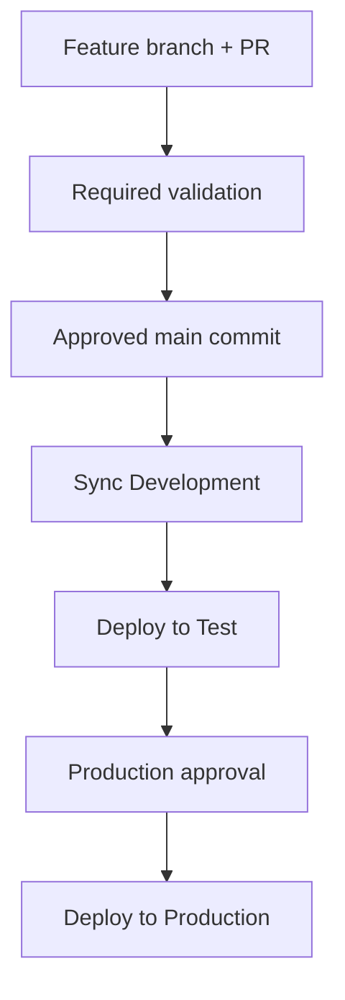

# OPS-001 — Fabric CI/CD and environment promotion

OPS-001 implements the environment-isolation decision in ADR-002 using a Fabric-native hybrid CI/CD model. GitHub governs source, validation, approvals, orchestration, and evidence; Microsoft Fabric Git integration and Deployment Pipelines synchronize and promote Fabric items.

## Implemented outcome

- Separate `Northstar Data Platform - Dev`, `- Test`, and `- Prod` workspaces.
- Development is the only workspace connected to Git (`main`, folder `02-dataops-devops/OPS-001/workspace`).
- Test and Production receive definitions through `Northstar Data Platform CI-CD`.
- Fabric Variable Library value sets provide Development, Test, and Production configuration.
- GitHub Actions validates definitions without Fabric credentials.
- GitHub Actions authenticates to Fabric with Entra workload identity federation (OIDC); no client secret is used.
- Protected GitHub environments hold non-secret routing identifiers and gate Production.
- Automated Development-to-Test promotion and Git-revert rollback were demonstrated.
- Production authorization was tested with an approved, non-deploying preflight.

## Repository contents

| Path | Purpose |
|---|---|
| `workspace/` | Fabric Variable Library and notebook definitions synchronized to Development |
| `scripts/validate_fabric_artifacts.py` | Credential-free structure, policy, contract, and secret-material checks |
| `scripts/fabric_promote.py` | Fabric preflight/deployment client and sanitized evidence writer |
| `.github/workflows/ops-001-fabric-validation.yml` | Required PR validation |
| `.github/workflows/fabric-promote.yml` | Protected OIDC preflight and deployment workflow |
| `architecture.md` | Boundaries, configuration ownership, and identities |
| `BRANCHING.md` | Trunk-based change process and workspace lifecycle |
| `RELEASE-PROCESS.md` | Promotion gates and release evidence |
| `ROLLBACK.md` | Definition rollback and stateful forward recovery |
| `evidence/` | Evidence index and machine-readable release manifest |
| `RETRO.md` | Results, lessons, limitations, and next improvements |

`parameter.yml` is intentionally absent. The representative items require no definition-time substitution; Variable Library value sets provide supported stage configuration. Add parameterization only when a real item reference cannot use a Variable Library, deployment rule, or Fabric autobinding.

## Promotion model

Production was not deployed during OPS-001. The approval, OIDC identity, pipeline routing, and Production workspace access were verified through preflight mode.

## Representative validation contract

| Environment | Release ring | Minimum quality | Destructive tests |
|---|---|---:|---:|
| Development | `development` | 90 | true |
| Test | `validation` | 95 | false |
| Production | `stable` | 99 | false |

The default values are deliberately unusable (`unconfigured`) so a missing active stage value set fails safely.

## Evidence

See [evidence/README.md](evidence/README.md) for links to PRs, workflow runs, Fabric operation identifiers, approval evidence, and the rollback chain.

