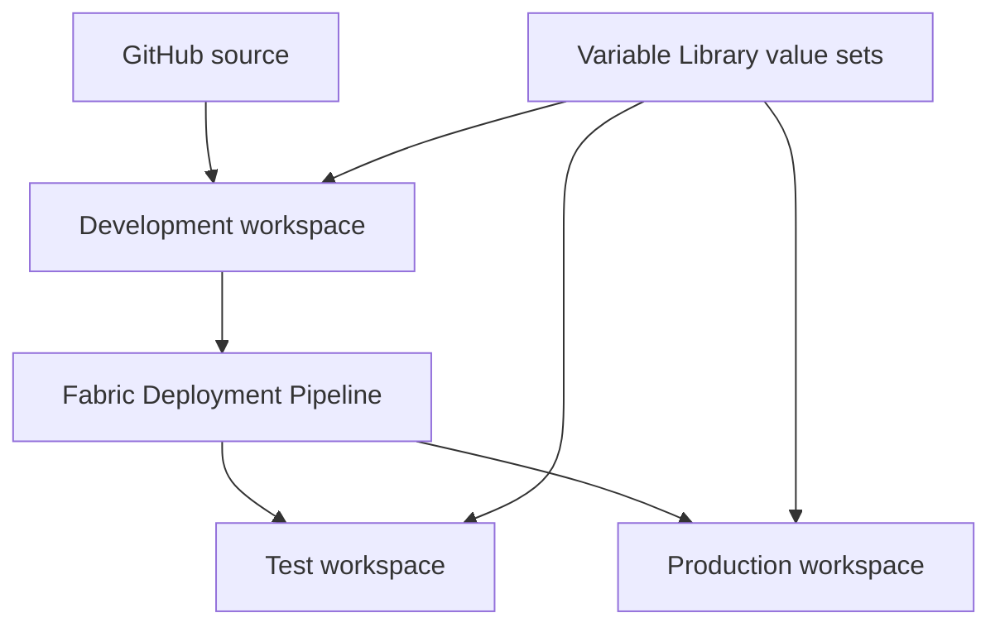

# OPS-001 architecture

## Boundaries

| Concern | System of record | Notes |
|---|---|---|
| Fabric item definitions | Git | Same approved definitions move through every stage |
| Runtime stage values | Fabric Variable Library | Active value set remains stage-specific |
| Automation routing | GitHub Environment variables | Tenant, application, pipeline, stage, and workspace identifiers; no credentials |
| Authentication | Entra workload identity federation | Short-lived OIDC token; no client secret |
| Promotion history | Fabric Deployment Pipeline | Development → Test → Production |
| Validation and approvals | GitHub Actions and protected environments | Required PR check and Production reviewer gate |
| Release evidence | GitHub run artifacts, PRs, Fabric IDs, Issue #8 | Sanitized; tokens are never retained |

## Workspace strategy

OPS-001 uses one complete solution workspace per environment. This keeps the first lifecycle implementation understandable while still providing security, Git, deployment, and operational boundaries. Split engineering, serving, shared-data-product, or operations workspaces only when ownership, permission, capacity, or release cadence requires independent lifecycle management.

## Identity and permissions

The Entra application `northstar-fabric-cicd` has immutable GitHub OIDC subjects for the `test` and `production` environments. Its service principal belongs to `SG-Fabric-CICD`, the group allowed to call Fabric public APIs.

Required Fabric access:

- Contributor on Development, Test, and Production workspaces.
- Admin on the deployment pipeline.
- No permission to create workspaces, connections, or deployment pipelines.

Required GitHub workflow permissions:

- `contents: read`
- `id-token: write`

## Configuration behavior

The deployable Variable Library contains safe defaults and three named value sets. Git does not store the active stage selection. Development activates `development`, Test activates `test`, and Production activates `production`. Item definitions therefore remain identical while runtime values differ.

Workspace, tenant, application, and deployment-pipeline identifiers are routing metadata held in GitHub Environment variables. They are not embedded in Fabric definitions. Credentials and access tokens are neither committed nor written to evidence.

