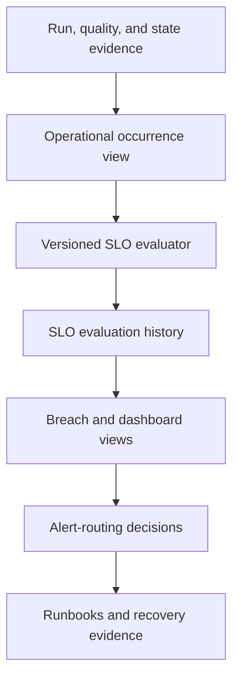

# OPS-002 — Operational telemetry architecture

**Status:** Proposed for implementation

## Decision summary

OPS-002 will add a small operational evaluation layer to the existing Northstar control database. Existing FAB-002 and FAB-003 tables remain the authoritative execution, quality, and watermark evidence. OPS-002 adds reproducible projections, durable SLO evaluations, explicit exclusions, and idempotent alert-routing decisions.

It does not copy source payloads, replace runtime state, or alter immutable metadata release 1.0.0.

## Components

### Existing authoritative evidence

| Source | Role |
|---|---|
| `ops.ExecutionRun` | Environment, release, trigger, correlation, and parent status |
| `ops.ObjectRun` | Attempt status, boundary, row counts, error, and duration |
| `ops.QualityDecision` | Accepted, warning, or blocked publication decision |
| `ops.QualityCheckResult` | Rule-level result, enforcement, and evaluation duration |
| `ops.WatermarkCandidate` | Proposed, committed, or abandoned state boundary |
| `ops.WatermarkState` | Current committed boundary and committing object run |
| `audit.StateEvent` | Append-only transition and recovery evidence |
| `ctrl.Schedule` / `ctrl.ObjectSchedule` | Eligibility, time zone, and deadline definition |
| `ctrl.SloDefinition` / `ctrl.ObjectSlo` | Immutable release-scoped objective assignments |
| `ctrl.ObjectOwnership` / `ctrl.OwnerGroup` | Accountable roles and safe routing aliases |

### New durable records

#### `ops.TelemetryExclusion`

Stores the only permitted denominator exclusions.

Important fields:

- `telemetry_exclusion_id`;
- environment and optional ingestion-object scope;
- `exclusion_type`: `PLANNED_MAINTENANCE`, `DISABLED_OBJECT`, or `FAILURE_EXERCISE`;
- effective start and end;
- actor, reason, and approval reference;
- creation time.

Constraints prohibit open-ended periods, blank approval evidence, and exclusions created after the excluded interval begins. Exclusions never delete or rewrite execution evidence.

#### `ops.SloEvaluation`

Stores one immutable calculation result per objective, scope, window, and evaluator version.

Important fields:

- `slo_evaluation_id`;
- evaluator version and source-evidence hash;
- environment, release, objective key, and optional ingestion object;
- window start/end;
- numerator, denominator, observed value, target, operator, and unit;
- `PASS`, `BREACH`, or `NO_DATA`;
- severity, error-budget consumption, and detection time.

A unique natural key prevents repeated evaluation from appending duplicate results for the same version and window. Re-evaluation with changed logic requires a new evaluator version rather than mutating history.

#### `ops.AlertRoutingDecision`

Stores the decision to route, suppress, simulate, or request a notification. It is not proof that an external service delivered a message.

Important fields:

- `alert_routing_decision_id`;
- SLO evaluation or object-run evidence identity;
- environment, release, ingestion object, category, and severity;
- owner role, owner group, and logical routing alias;
- `delivery_mode`: `SIMULATED` or `NOTIFICATION_REQUESTED`;
- `decision_status`: `ROUTED`, `SUPPRESSED`, or `NO_ROUTE`;
- deterministic deduplication key;
- reason and creation time.

A unique key on the deduplication identity and routing alias makes replay idempotent.

## New projections

| Projection | Purpose |
|---|---|
| `ops.vw_OperationalOccurrence` | One logical occurrence from correlated execution, object-run, quality, and watermark evidence |
| `ops.vw_QualityEnforcementIntegrity` | Prove every BLOCK decision preserved state and prevented accepted completion |
| `ops.vw_SloEvaluationLatest` | Latest evaluator-version result for each objective and window |
| `ops.vw_OpenSloBreach` | Current actionable breaches with correlation and ownership context |
| `ops.vw_AlertRoutingCandidate` | Deterministic environment-aware routing candidates |
| `ops.vw_OperationsDashboard` | Compact operational surface for status, timing, quality, and breach review |

## Occurrence rules

The initial vertical slice uses `run_id + ingestion_object_key` as the occurrence scope and retains every `object_run_id` attempt. FAB-002 recovery reuses the fixed object-run identity, so replay does not create a second occurrence.

For each occurrence:

- the earliest attempt start is the duration start;
- the latest terminal attempt is the final outcome;
- the first accepted quality decision is the publication time;
- `SUCCEEDED_WITH_WARNINGS` remains accepted;
- `BLOCKED` is a quality miss but not automatically a platform failure;
- a blocking decision paired with a committed watermark or accepted status is a control-integrity breach.

If a future runtime uses a new run identity for recovery, it must add an explicit `recovery_of_object_run_id` or stable occurrence identity before the evaluator groups those attempts.

## Time handling

- Evidence is stored and compared in UTC.
- Daily deadlines originate from the schedule's IANA time zone.
- SQL Database does not natively resolve arbitrary IANA zones. The evaluator therefore accepts pre-resolved UTC eligibility/deadline timestamps from the orchestration or evaluation notebook and records the resolution basis.
- The initial synthetic vertical slice uses `SCHEDULE_PROXY` because the source does not expose a durable availability timestamp.
- A source-reported availability time, when later available, takes precedence and is labeled `SOURCE_REPORTED`.

## Evaluation flow

1. Select the window, environment, evaluator version, and objective.
2. Resolve eligible objects from the run's immutable metadata release.
3. Build logical occurrences and join quality/state evidence.
4. Apply only preapproved `TelemetryExclusion` rows.
5. Calculate numerator, denominator, observed value, and error-budget consumption.
6. Hash the ordered source evidence and calculation inputs.
7. Insert the immutable `SloEvaluation` result if its natural key is absent.
8. Project breaches to alert-routing candidates.
9. Insert routing decisions idempotently.
10. Expose results through operational views.

## Transaction and failure behavior

- SLO evaluation never updates `WatermarkState`, `WatermarkCandidate`, `ObjectRun`, or quality evidence.
- Evaluation and routing history are append-only for a given evaluator version.
- A failed evaluation records no partial result; it may be replayed safely.
- Routing replay returns the existing decision for the same deduplication key.
- Missing telemetry produces `NO_DATA` or a telemetry-integrity breach; it is never silently excluded.
- A quality-enforcement violation bypasses the normal error budget and becomes an immediate critical breach.

## Initial vertical slice

The first executable slice will:

1. project the existing synthetic clinical-encounter object run;
2. evaluate reliability, duration, quality acceptance, and quality-enforcement integrity;
3. record a simulated Development routing decision;
4. prove idempotent re-evaluation and deduplication;
5. inject a blocked-result/state mismatch in the credential-free test model, not the live control database;
6. verify that Production would request notification while Development and Test remain simulated.

## Security and privacy

- No payload, patient identifier, endpoint, email address, tenant ID, or secret is stored.
- Error summaries are sanitized before operational display.
- Routing resolves only allowlisted aliases already stored in metadata.
- Production notification execution is outside this public learning implementation.
- Operators receive read access to projections; evaluators and routers receive narrowly scoped execute/insert permissions.
