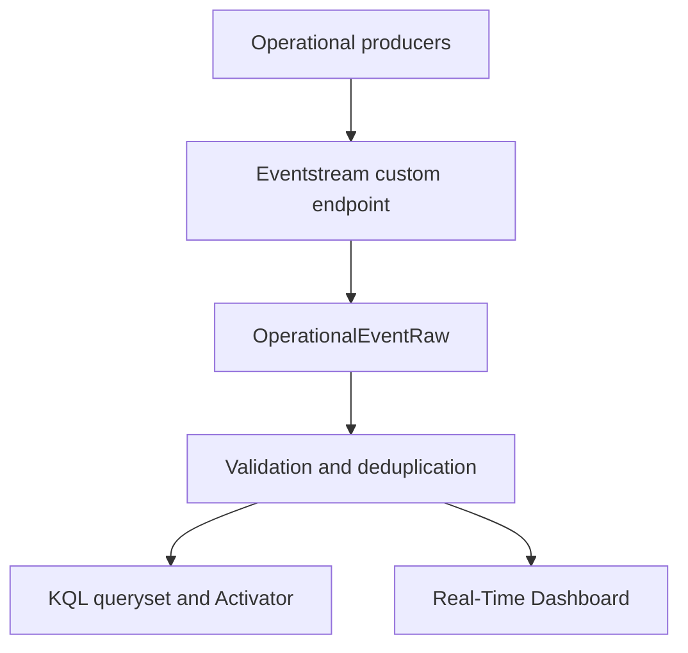

# RTI-001 architecture

## Data flow

The notebook is a synthetic producer used to validate the path. The contract is intended to be reusable by the FAB-002 through FAB-004 execution, quality, recovery, and benchmark workflows.

## Processing model

1. A producer emits a version `1.0.0` JSON event to the Eventstream custom endpoint.
2. The Eventstream performs JSON mapping and writes the event to `OperationalEventRaw`.
3. `OperationalEventValidated()` adds ingestion time, contract status, rejection reason, and late-arrival classification.
4. `OperationalEventAccepted()` retains one accepted logical occurrence per `EventId`.
5. `OperationalObjectCurrent()` selects the highest sequence for each `ObjectRunId`.
6. The dashboard reads validated, accepted, and current-state projections according to each tile's purpose.
7. Activator evaluates the two-minute actionable window every 60 seconds and sends a contextual notification for every returned event.

## State and edge-event behavior

| Condition | Handling |
|---|---|
| Duplicate | Physical copies remain in raw storage; accepted projection returns one logical event per `EventId` |
| Late | Accepted when contract-valid and marked `IsLate=true` when event time is more than five minutes behind ingestion |
| Malformed contract | Marked `REJECTED` with a deterministic reason and excluded from accepted/current projections |
| Out of order | Current state is chosen by maximum `SequenceNumber`, independent of arrival order |

## Alert boundary

An event is actionable when its status is `FAILED`, `QUALITY_BLOCKED`, or `RECOVERY_REQUIRED`, or its severity is `ERROR` or `CRITICAL`. The saved query limits consideration to events ingested in the last two minutes. The notification includes event, correlation, pipeline, object, status, severity, error classification, emission, ingestion, and detection-latency context.

The Activator was stopped after live validation to prevent repeated test notifications. This does not change its committed configuration or evidence.

## Data lifecycle

Both operational tables use 30-day soft-delete retention and a 7-day hot-data/hot-index cache. This is appropriate for a focused operational exercise, not a universal enterprise retention standard. Long-term incident or compliance evidence should be exported to a governed durable store.

## Security boundary

- The Eventstream connection string is held in Azure Key Vault under `rti001-eventstream-connection-string`.
- The notebook resolves the secret through `notebookutils.credentials.getSecret` at runtime.
- No connection-string value is present in committed notebook source.
- Test payloads are synthetic and contain no patient data.
- Fabric-generated definitions may contain item identifiers needed for binding; credentials must never be added to those definitions.

