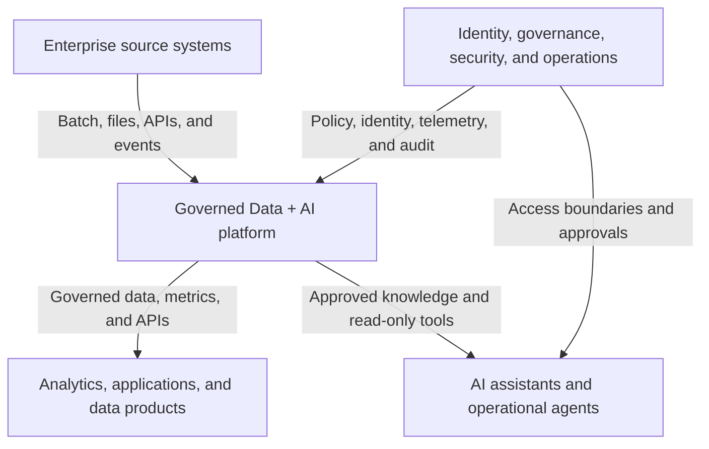

# Enterprise Context Diagram

This diagram defines the principal actors, systems, and trust boundaries for the fictional Northstar Health System reference scenario. It intentionally remains technology-neutral; component selections and tradeoffs will be recorded in later architecture decision records.

## Boundary descriptions

### Enterprise source systems

EHR, patient access, ERP, workforce, claims, pharmacy, supply chain, facilities, external files, partner APIs, and operational event sources remain authoritative systems of record.

### Governed Data + AI platform

The platform provides ingestion, storage, transformation, orchestration, metadata, data quality, lineage, semantic access, governed APIs, AI grounding, observability, deployment, and recovery capabilities.

### Analytics, applications, and data products

Authorized consumers include executives, clinical and operational leaders, analysts, data scientists, applications, Power BI solutions, APIs, and approved downstream systems.

### AI assistants and operational agents

AI capabilities retrieve approved enterprise knowledge and use explicitly defined tools. Initial operational tools are read-only and support diagnosis and recommendations. Consequential actions require human approval, least privilege, and a durable audit record.

### Identity, governance, security, and operations

Cross-cutting controls define identity, access, networking, classification, lineage, quality policies, deployment controls, monitoring, incident response, cost management, and audit requirements.

## Primary flows

| Flow | Description | Required controls |
|---|---|---|
| Source to platform | Batch, file, API, and event ingestion | Authentication, encryption, validation, classification, lineage, and reconciliation |
| Platform to consumer | Governed tables, semantic models, reports, events, and APIs | Authorization, contracts, quality status, freshness, and audit |
| Platform to AI | Approved documents, metadata, lineage, operational telemetry, and bounded tools | User-context authorization, grounding, citations, filtering, and tracing |
| AI to operations | Diagnosis and recommended recovery actions | Read-only default, confidence and evidence, approval for consequential action, and audit |
| Operations to platform | Deployment, configuration, monitoring, replay, and recovery | Separation of duties, environment promotion, secrets boundaries, correlation, and rollback evidence |

## Trust boundaries

1. Source-system identities and permissions do not automatically transfer to the platform.
2. Raw ingestion zones are not directly exposed to general consumers or AI systems.
3. Production access is separate from development and test access.
4. AI retrieval is constrained by the requesting identity and approved knowledge corpus.
5. Agent diagnosis, recommendation, approval, and execution are distinct permission levels.
6. Cross-boundary movement of sensitive data is logged and governed.
